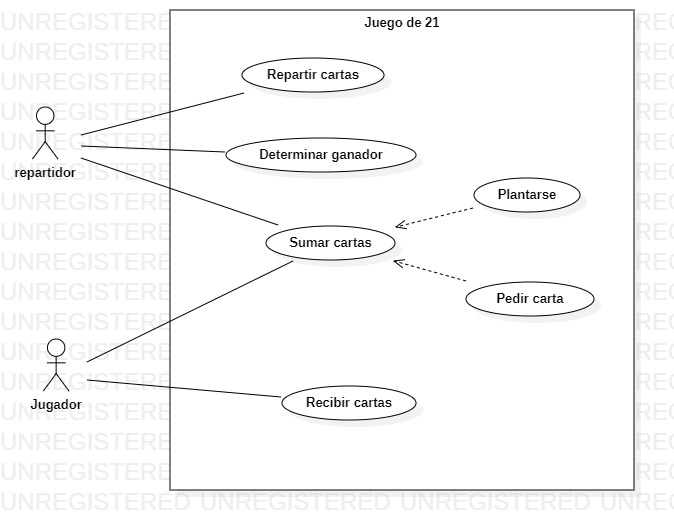
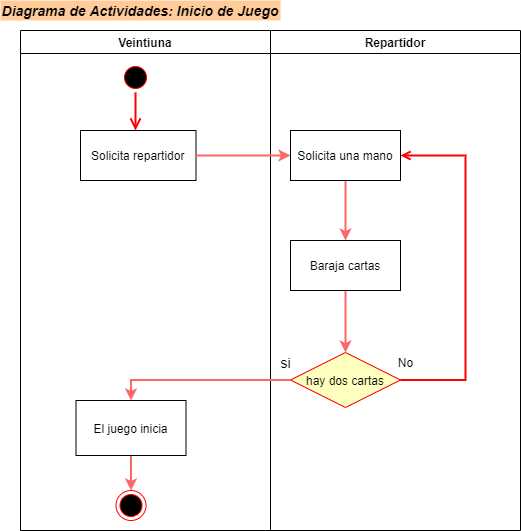
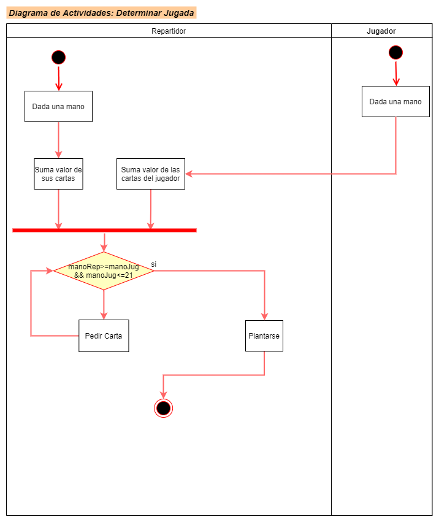
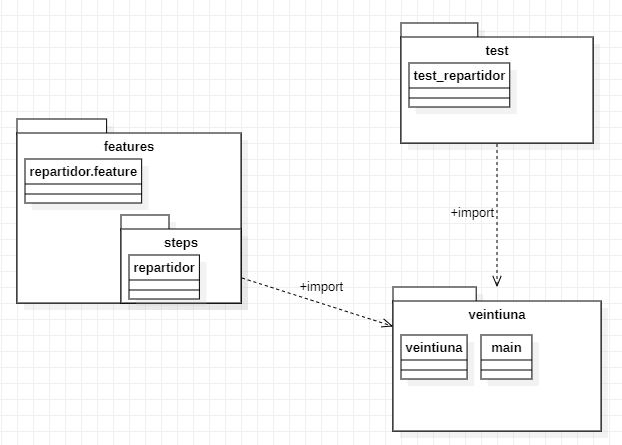
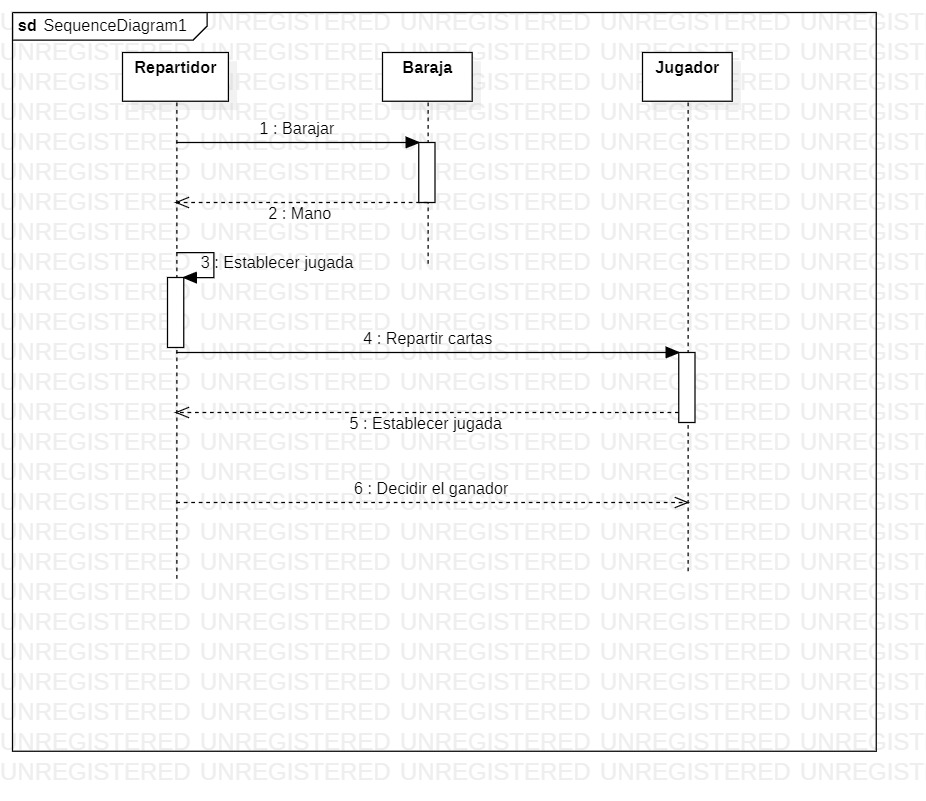

# Modelado UML
 Modelado Juego Veintiuna - Fundamentos de Ingeniería de Software
 &nbsp;
## Integrantes:
- Diego Vélez
&nbsp;
- Sebastián Gonzalez
&nbsp;
- Oscar Carrillo

# Veintiuna
## Ejercicio de desarrollo basado en pruebas

El veintiuna, es un juego de cartas, con una o más barajas inglesas de 52 cartas sin los comodines, que consiste en sumar un valor lo más próximo a 21 pero sin pasarse. En esta versión un jugador juega únicamente contra el repartidor, intentando conseguir una mejor jugada que este. 

El repartidor en esta versión está sujeto a reglas fijas que le impiden tomar decisiones sobre el juego. Por ejemplo, está obligado a pedir carta siempre que su puntuación sume 16 o menos o sea menor que la del jugador, y solo se planta si supera o iguala la puntación del jugador. 

Las cartas numéricas suman su valor, las figuras suman 10 y el As vale 11 o 1, 11 mientras no se pase de 21, y 1 en caso contrario. 

## Historias de usuario asociadas al juego

- __Como__ repartidor __quiero__ tomar dos cartas __para__ iniciar el juego
- __Como__ repartidor __quiero__ sumar los valores de una mano __para__ saber el valor total
- __Como__ repartidor __quiero__ conocer el valor de la mano del jugador y el valor de mi mano __para__ determinar mi jugada

## Diagrama de Casos de uso

## Diagrama de Clases
- ### Juego

- ### Test

## Diagrama de Actividades

- ### Actividad Inicio de Juego
 

 - ### Actividad Determinar Jugada
  

## Diagrama de Paquetes 

 
 
 ## Diagrama de Despligue 
 

 ## Diagrama de Secuencia 
 

